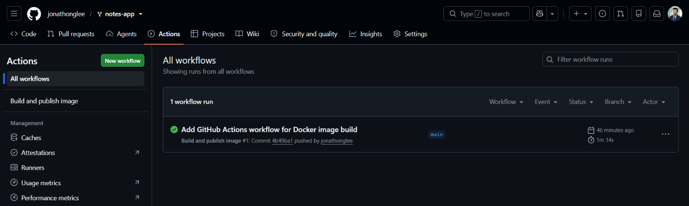
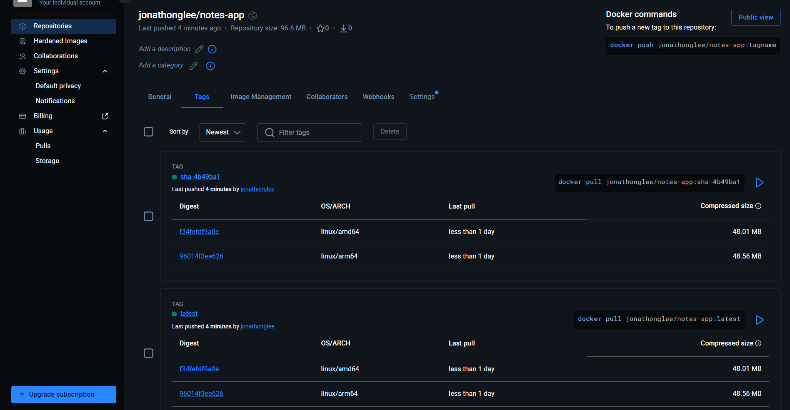
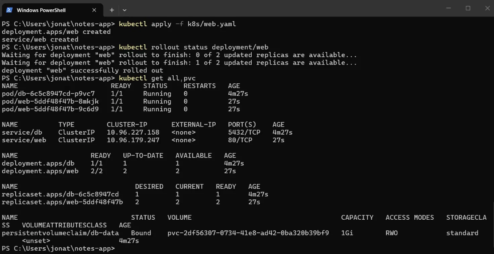
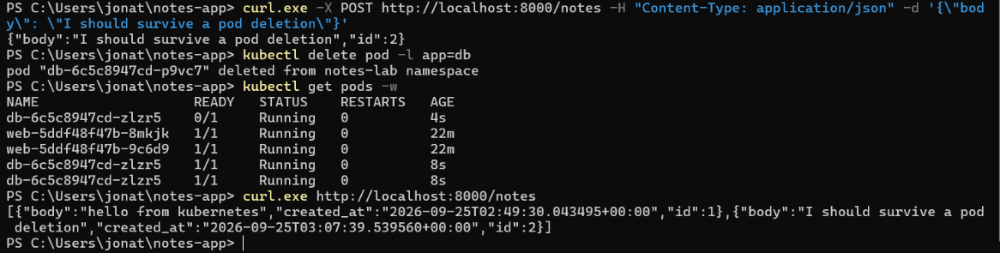
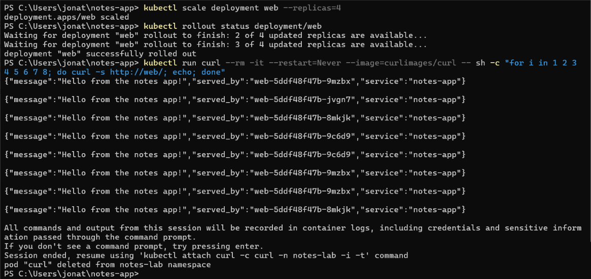
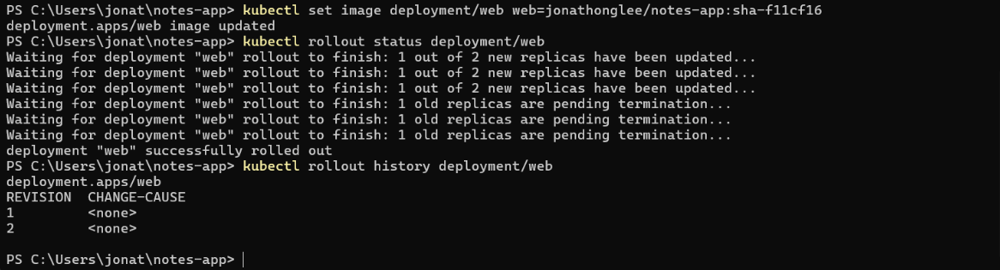

# Lab 5 Evidence

## 1. Successful GitHub Actions Run

## 2. Docker Hub Tags (both architectures)

## 3. kubectl get all,pvc Output

## 4. Experiment 2 - Data Persistence

## 5. Experiment 3 - Load Balancing Across Replicas

## 6. kubectl rollout history deployment/web
